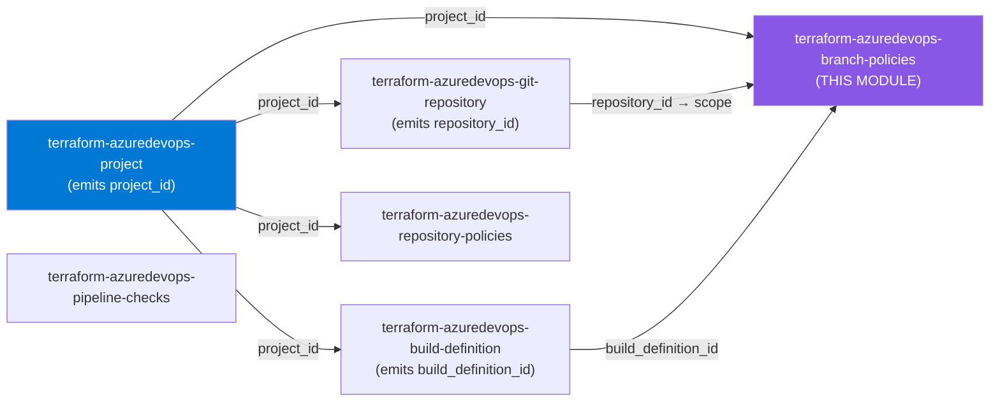

# 🔷 Azure DevOps **Branch Policies** Terraform Module

> **Aggregates all seven Azure DevOps branch-protection policy types — minimum reviewers, build validation, status checks, merge-type limits, comment resolution, automatically-included reviewers, and work-item linking — behind one project-scoped module, each as an independently-optional `for_each` collection.** Built for azuredevops **v1.x**.


---

## 🧩 Overview

- 👥 **Minimum reviewers** — require a configurable number of approvals on pull requests, with segregation-of-duties controls (last pusher can't approve, submitter can't self-vote, vote-reset on push).
- 🏗️ **Build validation** — require a pipeline to build PR changes successfully before completion, with expiration and path-filter control.
- ✅ **Status checks** — require an external/third-party service to post a successful status before a PR can merge.
- 🔀 **Merge-type limits** — control branch history by allowing only specific merge strategies (squash / rebase / basic / semi-linear).
- 💬 **Comment resolution** — require all PR comments to be resolved before completion.
- 🧑‍🤝‍🧑 **Automatically-included reviewers** — add the right reviewers automatically when a PR touches matching paths.
- 🔗 **Work-item linking** — require PRs to be linked to at least one work item for traceability.

> 💡 **Why it matters:** branch policies are the enforcement layer of a Git workflow — they keep `main` releasable, gate changes behind review and CI, and make change-management auditable. This module declares that posture as code, consistently, with the secure default that a declared policy is **enabled and blocking**.

---

## ❤️ Support this project

If these Terraform modules have been helpful to you or your organization, I'd appreciate your support in any of the following ways:

- ⭐ **Star this repository** to help others discover this Terraform module.
- 🤝 **Connect with me on LinkedIn:** [linkedin.com/in/microsoftexpert](https://www.linkedin.com/in/microsoftexpert)
- ☕ **Buy me a coffee:** [buymeacoffee.com/microsoftexpert](https://buymeacoffee.com/microsoftexpert)

Whether it's a star, a professional connection, or a coffee, every gesture helps keep these modules actively maintained and continually improving. Thank you for being part of the community!

---

## 🗺️ Where this fits in the family



---

## 🧬 What this module builds

This is an **aggregation** module: there is **no parent `this` resource**. Each policy type is a peer `for_each` collection keyed by a caller-supplied stable string, scoped via its own `scope` block to repositories/branches inside `project_id`.

```mermaid
flowchart TB
 pid(["var.project_id"])

 mr["azuredevops_branch_policy_min_reviewers<br/>for_each = var.min_reviewers"]
 bv["azuredevops_branch_policy_build_validation<br/>for_each = var.build_validation"]
 sc["azuredevops_branch_policy_status_check<br/>for_each = var.status_check"]
 mt["azuredevops_branch_policy_merge_types<br/>for_each = var.merge_types"]
 cr["azuredevops_branch_policy_comment_resolution<br/>for_each = var.comment_resolution"]
 ar["azuredevops_branch_policy_auto_reviewers<br/>for_each = var.auto_reviewers"]
 wil["azuredevops_branch_policy_work_item_linking<br/>for_each = var.work_item_linking"]

 pid --> mr
 pid --> bv
 pid --> sc
 pid --> mt
 pid --> cr
 pid --> ar
 pid --> wil

 style mr fill:#8957E5,color:#fff
 style bv fill:#8957E5,color:#fff
 style sc fill:#8957E5,color:#fff
 style mt fill:#8957E5,color:#fff
 style cr fill:#8957E5,color:#fff
 style ar fill:#8957E5,color:#fff
 style wil fill:#8957E5,color:#fff
```



**Resource inventory (7 collections):**

- `azuredevops_branch_policy_min_reviewers` — `min_reviewers`
- `azuredevops_branch_policy_build_validation` — `build_validation`
- `azuredevops_branch_policy_status_check` — `status_check`
- `azuredevops_branch_policy_merge_types` — `merge_types`
- `azuredevops_branch_policy_comment_resolution` — `comment_resolution`
- `azuredevops_branch_policy_auto_reviewers` — `auto_reviewers`
- `azuredevops_branch_policy_work_item_linking` — `work_item_linking`

---

## ✅ Provider / Versions

| Requirement | Version |
|---|---|
| Terraform | `>= 1.12.0` |
| `microsoft/azuredevops` | `>= 1.0, < 2.0` (GA line v1.x) |

The module declares the provider **requirement** only — it configures **no** `provider {}` block. The root/spec configures the org URL and PAT or service principal.

---

## 🔑 Required Azure DevOps Scopes / Auth

Creating and editing branch policies requires the running identity to be a member of the **Project Administrators** security group **or** to hold the repository-level **Edit policies** permission on the target repository/branch.

| Scope / Role | PAT scope | Service-principal role | Required for |
|---|---|---|---|
| **Code** | Code (Read, Write & Manage) | Project Administrators **or** repository-level **Edit policies** | creating/updating every `branch_policy_*` in this module |
| **Build (read)** | Build (Read) | — | resolving the `build_definition_id` referenced by `build_validation` policies |

> ⚠️ Managing policies project-wide (`repository_id = null`, all repositories), or on a branch that already carries *required* policies, effectively requires **Project Administrators**. Repository-level **Edit policies** only covers repos the identity has been explicitly granted it on.

---

## 📁 Module Structure

```
terraform-azuredevops-branch-policies/
├── providers.tf # Terraform >= 1.12, azuredevops >= 1.0, < 2.0 (no provider block)
├── variables.tf # project_id + 7 independently-optional map(object) collections
├── main.tf # 7 for_each resources, named by role (no `this`)
├── outputs.tf # per-role <role>_ids maps + flattened `ids` + project_id
├── SCOPE.md # cross-module contract + required scopes/auth + gotchas
└── README.md # this file
```

---

## ⚙️ Quick Start

The smallest useful call — require 2 reviewers on the default branch:

```hcl
module "branch_policies" {
  source = "git::https://github.com/microsoftexpert/terraform-azuredevops-branch-policies?ref=v1.0.0"

  project_id = module.project.project_id

  min_reviewers = {
    main = {
      settings = {
        reviewer_count = 2
        scope = [{
          match_type = "DefaultBranch"
        }]
      }
    }
  }
}
```

---

## 🔌 Cross-Module Contract

### Consumes

| Input | Type | Source module |
|---|---|---|
| `project_id` | `string` | `terraform-azuredevops-project` (`project_id`) |
| `repository_id` *(per-scope)* | `string` | `terraform-azuredevops-git-repository` (`repository_id`) — supplied inside each policy's `scope` |
| `build_definition_id` *(per build_validation)* | `number` | `terraform-azuredevops-build-definition` — supplied inside `build_validation.settings` |

### Emits

| Output | Description | Consumed by |
|---|---|---|
| `min_reviewers_ids` | Map of min-reviewer policy IDs keyed by collection key | audit / access review |
| `build_validation_ids` | Map of build-validation policy IDs | audit / access review |
| `status_check_ids` | Map of status-check policy IDs | audit / access review |
| `merge_types_ids` | Map of merge-type policy IDs | audit / access review |
| `comment_resolution_ids` | Map of comment-resolution policy IDs | audit / access review |
| `auto_reviewers_ids` | Map of auto-reviewer policy IDs | audit / access review |
| `work_item_linking_ids` | Map of work-item-linking policy IDs | audit / access review |
| `ids` | Flattened map of **all** policy IDs keyed by `"<role>/<key>"` | audit / access review |
| `project_id` | The project ID these policies were created in (passthrough) | downstream composition |

---

## 📚 Example Library

<details>
<summary><b>1 · Minimum reviewers on the default branch (project-wired)</b></summary>

```hcl
module "branch_policies" {
  source     = "git::https://github.com/microsoftexpert/terraform-azuredevops-branch-policies?ref=v1.0.0"
  project_id = module.project.project_id

  min_reviewers = {
    main = {
      settings = {
        reviewer_count             = 2
        last_pusher_cannot_approve = true
        scope                      = [{ match_type = "DefaultBranch" }]
      }
    }
  }
}
```
</details>

<details>
<summary><b>2 · Strict reviewers with vote-reset on push</b></summary>

```hcl
min_reviewers = {
  main = {
    settings = {
      reviewer_count                         = 2
      submitter_can_vote                     = false
      last_pusher_cannot_approve             = true
      allow_completion_with_rejects_or_waits = false
      on_push_reset_all_votes                = true # implies on_push_reset_approved_votes
      on_each_iteration_require_vote         = true
      scope                                  = [{ match_type = "DefaultBranch" }]
    }
  }
}
```
</details>

<details>
<summary><b>3 · Build validation (cross-module: pipeline → policy)</b></summary>

```hcl
build_validation = {
  ci = {
    settings = {
      build_definition_id         = module.build.build_definition_id
      display_name                = "PR build"
      queue_on_source_update_only = true
      valid_duration              = 720 # minutes; 0 = never expires
      scope                       = [{ match_type = "DefaultBranch" }]
    }
  }
}
```
</details>

<details>
<summary><b>4 · Build validation scoped to one repo + path filter</b></summary>

```hcl
build_validation = {
  app_ci = {
    settings = {
      build_definition_id = module.build.build_definition_id
      display_name        = "App CI"
      filename_patterns   = ["/src/*", "!/src/docs/*"] # "!" excludes
      scope = [{
        repository_id  = module.repo.repository_id
        repository_ref = "refs/heads/main"
        match_type     = "Exact"
      }]
    }
  }
}
```
</details>

<details>
<summary><b>5 · External status check (conditional applicability)</b></summary>

```hcl
status_check = {
  sonarqube = {
    settings = {
      name                 = "SonarQube/quality-gate"
      genre                = "continuous-integration"
      applicability        = "conditional" # only after a status is posted
      invalidate_on_update = true
      display_name         = "SonarQube Quality Gate"
      scope                = [{ match_type = "DefaultBranch" }]
    }
  }
}
```
</details>

<details>
<summary><b>6 · Limit merge types (squash-only)</b></summary>

```hcl
merge_types = {
  squash_only = {
    settings = {
      allow_squash                  = true
      allow_basic_no_fast_forward   = false
      allow_rebase_and_fast_forward = false
      allow_rebase_with_merge       = false
      scope                         = [{ match_type = "DefaultBranch" }]
    }
  }
}
```
</details>

<details>
<summary><b>7 · Require comment resolution</b></summary>

```hcl
comment_resolution = {
  main = {
    settings = {
      scope = [{ match_type = "DefaultBranch" }]
    }
  }
}
```
</details>

<details>
<summary><b>8 · Require linked work items</b></summary>

```hcl
work_item_linking = {
  main = {
    settings = {
      scope = [{ match_type = "DefaultBranch" }]
    }
  }
}
```
</details>

<details>
<summary><b>9 · Automatically-included reviewers (group on a path)</b></summary>

```hcl
auto_reviewers = {
  security_team = {
    settings = {
      auto_reviewer_ids           = [module.security_group.id] # group descriptor
      path_filters                = ["/infra/*", "*.tf"]
      message                     = "Security review required for infra changes."
      minimum_number_of_reviewers = 1
      scope                       = [{ match_type = "DefaultBranch" }]
    }
  }
}
```
</details>

<details>
<summary><b>10 · Advisory (non-blocking) policy — stage before enforcing</b></summary>

```hcl
work_item_linking = {
  main = {
    enabled  = true
    blocking = false # advisory: warns but does not block completion
    settings = {
      scope = [{ match_type = "DefaultBranch" }]
    }
  }
}
```
</details>

<details>
<summary><b>11 · One policy, multiple scopes (default branch + release prefix)</b></summary>

```hcl
min_reviewers = {
  protected = {
    settings = {
      reviewer_count = 2
      scope = [
        { match_type = "DefaultBranch" },
        {
          repository_id  = module.repo.repository_id
          repository_ref = "refs/heads/releases"
          match_type     = "Prefix"
        },
      ]
    }
  }
}
```
</details>

<details>
<summary><b>12 · Project-wide policy across all repositories</b></summary>

```hcl
comment_resolution = {
  all_repos = {
    settings = {
      # repository_id omitted (null) + Exact/Prefix = applies to ALL repos in the project
      scope = [{
        repository_ref = "refs/heads/main"
        match_type     = "Exact"
      }]
    }
  }
}
```
</details>

<details>
<summary><b>13 · Multiple keyed policies of the same type</b></summary>

```hcl
build_validation = {
  unit_tests = {
    settings = {
      build_definition_id = module.build_unit.build_definition_id
      display_name        = "Unit tests"
      scope               = [{ match_type = "DefaultBranch" }]
    }
  }
  integration_tests = {
    settings = {
      build_definition_id = module.build_integration.build_definition_id
      display_name        = "Integration tests"
      manual_queue_only   = true
      scope               = [{ match_type = "DefaultBranch" }]
    }
  }
}
```
</details>

<details>
<summary><b>14 · End-to-end composition (project → repo → build → policies) — MANDATORY finale</b></summary>

```hcl
module "project" {
  source = "git::https://github.com/microsoftexpert/terraform-azuredevops-project?ref=v1.0.0"
  name   = "Payments"
}

module "repo" {
  source     = "git::https://github.com/microsoftexpert/terraform-azuredevops-git-repository?ref=v1.0.0"
  project_id = module.project.project_id
  name       = "payments-api"
}

module "build" {
  source     = "git::https://github.com/microsoftexpert/terraform-azuredevops-build-definition?ref=v1.0.0"
  project_id = module.project.project_id
  name       = "payments-api-ci"
  #... repository + yml_path wiring...
}

module "branch_policies" {
  source     = "git::https://github.com/microsoftexpert/terraform-azuredevops-branch-policies?ref=v1.0.0"
  project_id = module.project.project_id

  min_reviewers = {
    main = {
      settings = {
        reviewer_count             = 2
        last_pusher_cannot_approve = true
        scope                      = [{ match_type = "DefaultBranch" }]
      }
    }
  }

  build_validation = {
    ci = {
      settings = {
        build_definition_id = module.build.build_definition_id
        display_name        = "PR build"
        scope = [{
          repository_id  = module.repo.repository_id
          repository_ref = module.repo.default_branch
          match_type     = "Exact"
        }]
      }
    }
  }

  merge_types = {
    squash_only = {
      settings = {
        allow_squash = true
        scope        = [{ match_type = "DefaultBranch" }]
      }
    }
  }

  comment_resolution = { main = { settings = { scope = [{ match_type = "DefaultBranch" }] } } }
  work_item_linking  = { main = { settings = { scope = [{ match_type = "DefaultBranch" }] } } }
}

output "all_policy_ids" {
  value = module.branch_policies.ids
}
```
</details>

---

## 📥 Inputs

<details>
<summary><b>Full input schemas</b></summary>

Every collection is `map(object(...))` keyed by a caller string and defaults to `{}` (independently optional). All carry `enabled` (default `true`) and `blocking` (default `true`), plus a `settings` object whose `scope` is a list of `{ repository_id?, repository_ref?, match_type = "Exact" | "Prefix" | "DefaultBranch" }` (≥1 entry).

| Variable | Type | Required settings | Notable optional settings (defaults) |
|---|---|---|---|
| `project_id` | `string` | — | required, top-level |
| `min_reviewers` | `map(object)` | `reviewer_count`, `scope` | `submitter_can_vote (false)`, `last_pusher_cannot_approve (false)`, `allow_completion_with_rejects_or_waits (false)`, `on_push_reset_approved_votes (false)`, `on_push_reset_all_votes (false)`, `on_each_iteration_require_vote (false)`, `on_last_iteration_require_vote (false)` |
| `build_validation` | `map(object)` | `build_definition_id`, `display_name`, `scope` | `manual_queue_only (false)`, `queue_on_source_update_only (true)`, `valid_duration (720)`, `filename_patterns (null)` |
| `status_check` | `map(object)` | `name`, `scope` | `genre`, `author_id`, `invalidate_on_update (false)`, `applicability ("default")`, `display_name`, `filename_patterns` |
| `merge_types` | `map(object)` | `scope` | `allow_squash (false)`, `allow_rebase_and_fast_forward (false)`, `allow_basic_no_fast_forward (false)`, `allow_rebase_with_merge (false)` |
| `comment_resolution` | `map(object)` | `scope` | — |
| `auto_reviewers` | `map(object)` | `auto_reviewer_ids`, `scope` | `path_filters`, `submitter_can_vote (false)`, `message`, `minimum_number_of_reviewers (1)` |
| `work_item_linking` | `map(object)` | `scope` | — |

Validation enforced at plan time: every policy must define ≥1 `scope`; every `match_type` ∈ `{Exact, Prefix, DefaultBranch}`; `status_check.applicability` ∈ `{default, conditional}`; `auto_reviewers.auto_reviewer_ids` non-empty.
</details>

---

## 🧾 Outputs

| Output | Type | Sensitive |
|---|---|---|
| `min_reviewers_ids` | `map(string)` | no |
| `build_validation_ids` | `map(string)` | no |
| `status_check_ids` | `map(string)` | no |
| `merge_types_ids` | `map(string)` | no |
| `comment_resolution_ids` | `map(string)` | no |
| `auto_reviewers_ids` | `map(string)` | no |
| `work_item_linking_ids` | `map(string)` | no |
| `ids` | `map(string)` keyed by `"<role>/<key>"` | no |
| `project_id` | `string` | no |

> ℹ️ No output is `sensitive` — no branch policy field carries a credential, token, or key. Each `<role>_ids` map is empty (`{}`) when its collection is unused, never an error.

---

## 🧠 Architecture Notes

- **Project-scoped, branch-targeted.** Every `branch_policy_*` resource takes `project_id` at the top level; the *branch/repository* target lives in the per-policy `scope` block. There is no top-level `repository_id` on these resources, so the module deliberately exposes none.
- **Scope semantics.** `match_type = "DefaultBranch"` targets each repo's default branch (omit `repository_id`/`repository_ref`). `Exact`/`Prefix` with `repository_id = null` apply project-wide across **all** repositories; with `repository_id` set, they apply to a single repo.
- **Secure-by-default.** A declared policy is `enabled = true` and `blocking = true` — opt out explicitly to stage (`enabled = false`) or make advisory (`blocking = false`).
- **Eventual consistency.** Policies apply asynchronously; a PR opened seconds after `apply` may briefly not reflect a new policy.
- **No write-only secrets / no immutable-recreate traps here.** Unlike service connections, branch policies hold no secrets. `project_id` is effectively immutable per policy — changing it recreates the policy.
- **Prerequisites.** `build_validation` requires the pipeline to exist first (`build_definition_id`); `auto_reviewers` requires reviewer group/user descriptors (from `terraform-azuredevops-group`/`team`).

---

## 🧱 Design Principles

- **Aggregation, not composite** — no dominant `this`; each policy type is a peer `for_each` collection, named by role with the `azuredevops_branch_policy_` prefix dropped.
- **Independently optional** — every collection defaults to `{}`; callers use any, all, or none.
- **The type is the contract** — deeply-typed `object` schemas mirror the provider's `settings`/`scope` blocks; `optional` carries provider-matching defaults; `validation {}` guards every closed value set.
- **Total renderer** — `main.tf` is a pure projection: `dynamic "scope"` blocks and `try(x, null)` on optional nested fields, no business logic.
- **Maps in, maps out** — outputs mirror inputs as keyed maps for clean audit and composition.

---

## 🚀 Runbook

```powershell
cd C:\GitHubCode\newazuredevopsmodules\terraform-azuredevops-branch-policies
terraform init -backend=false
terraform validate
terraform fmt -check
```

> ℹ️ `terraform plan`/`apply` require live organization credentials (org URL + PAT, or an Azure AD service principal with the scopes above). The offline gate is sufficient for structural correctness — never test against the production org; use a dedicated non-production organization.

---

## 🧪 Testing

- `terraform validate` and `terraform fmt -check` must pass with zero errors/diffs (offline gate).
- Plan-time validation: malformed `match_type`, empty `scope`, invalid `applicability`, or empty `auto_reviewer_ids` are rejected before any API call.
- Live integration (non-prod org): apply, then confirm via the **Repos → Branches → Branch policies** UI or the Azure DevOps MCP server (`mcp_ado_repo_list_pull_request_threads`) that a PR reflects the policy.

---

## 💬 Example Output

```text
Apply complete! Resources: 5 added, 0 changed, 0 destroyed.

Outputs:

all_policy_ids = {
 "build_validation/ci" = "0affc3f7-..."
 "comment_resolution/main" = "1b2e4d90-..."
 "merge_types/squash_only" = "2c5f1a3b-..."
 "min_reviewers/main" = "3d6a2b4c-..."
 "work_item_linking/main" = "4e7b3c5d-..."
}
```

---

## 🔍 Troubleshooting

| Symptom | Likely cause | Fix |
|---|---|---|
| `403 Forbidden` / `TF401027` on apply | Identity lacks **Edit policies** / is not a **Project Administrator** | Grant repository-level **Edit policies** or add the identity to Project Administrators (see Required Scopes). |
| `401 Unauthorized` | PAT missing **Code (Read, Write & Manage)** or expired | Reissue the PAT with the correct scope; re-auth the service principal. |
| Policy created in the wrong place / "not found" repo | Org-vs-project mismatch, or `repository_id` from a different project | Ensure `project_id` and every scope `repository_id` belong to the **same** project. |
| `build_definition_id` invalid | Pipeline doesn't exist yet, or ID from another project | Create the pipeline first; pass `module.build.build_definition_id`. |
| PR doesn't show a just-applied policy | Eventual consistency | Wait briefly and refresh; re-open the PR. |
| `DefaultBranch` scope errors when `repository_id` set | `repository_id`/`repository_ref` provided alongside `match_type = "DefaultBranch"` | Omit `repository_id`/`repository_ref` for `DefaultBranch` scope entries. |
| `auto_reviewers` minimum-reviewers ignored | `blocking = false`, or `minimum_number_of_reviewers > 1` without exactly one group | Set `blocking = true`; use a single group descriptor to require more than one. |

---

## 🔗 Related Docs

- [Branch policies and settings (Microsoft Learn)](https://learn.microsoft.com/azure/devops/repos/git/branch-policies)
- [Git repository settings and policies](https://learn.microsoft.com/azure/devops/repos/git/repository-settings)
- [Set branch permissions](https://learn.microsoft.com/azure/devops/repos/git/branch-permissions)
- [azuredevops provider — branch_policy_* resources](https://registry.terraform.io/providers/microsoft/azuredevops/latest/docs)
- `SCOPE.md` — cross-module contract, required scopes/auth, provider gotchas
- Sibling modules: `terraform-azuredevops-project`, `terraform-azuredevops-git-repository`, `terraform-azuredevops-build-definition`, `terraform-azuredevops-repository-policies`, `terraform-azuredevops-pipeline-checks`

---

> 💙 *"Infrastructure as Code should be standardized, consistent, and secure."*
